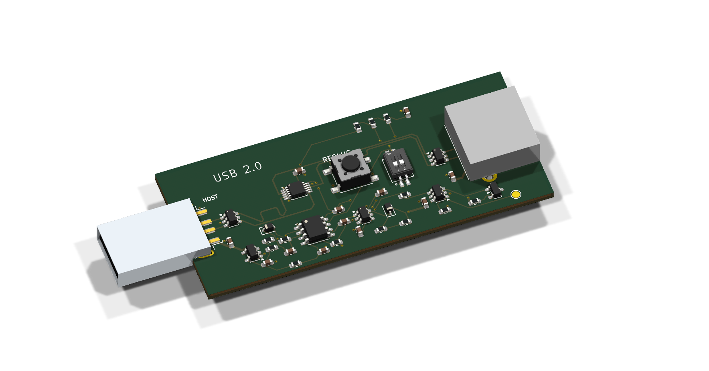

# USB Replug — revision B

A USB-A male-to-female adapter intended to simulate unplugging and reconnecting a USB 2.0 peripheral with one button press. A CMOS 555 provides the delay; there is no microcontroller or firmware.

**Public design review. Unbuilt prototype; not ready to order.** Assembly placement mappings remain unresolved and hardware performance has not been tested. This repository contains only the current revision B source and review material, not previous design iterations or fabrication releases.

[Schematic PDF](docs/schematic.pdf) · [3D STEP model](docs/usb-replug.step) · [BOM](bom.csv) · [Remaining work](docs/STATUS.md)

## Intended operation

Press the central button to disconnect device VBUS and both data lines, then reconnect automatically. Ground and shields stay connected. The trigger circuit is intended to let the timer expire even when the button remains held down.

| Two-position DIP switch | Approximate off time |
|---|---:|
| Both OFF | 3 seconds |
| Either ON | 2 seconds |
| Both ON | 1 second |

Change the DIP settings while idle. RC tolerance, leakage and capacitor bias affect timing; these are nominal settings, not calibrated delays.

## Open the design

Open `usb-replug.kicad_pro` in KiCad 10. The root schematic links three functional sheets. The PCB, footprints and referenced STEP models are included with project-relative paths. Official symbols are embedded in the schematics; the custom symbol library is under `libraries/`.

The board is 70 × 30 mm with four copper layers and nominal 1.6 mm thickness. Its fabrication target is JLC04161H-7628, outer 1 oz / inner 0.5 oz copper, green mask, white silkscreen and lead-free HASL. The male connector overhangs the PCB edge. A different manufacturer needs a stackup and assembly review.

## Validation

The packaged source was checked with KiCad 10.0.6: no reported ERC, PCB DRC, unconnected-item or schematic-parity findings. Reports and their configured ignored-check lists are included in `docs/checks/`. This is not a claim that every possible rule is enabled or that hardware works.

The intended USB data rate is up to 480 Mbps. Signal integrity, impedance, interoperability, ESD behavior, loaded voltage drop and timing still require review and physical testing. Length matching alone does not validate the USB routing; the layout includes uncoupled breakout sections. A self-powered peripheral may disconnect logically without actually power-cycling. Host power budget includes the adapter's own consumption.

## Assembly and availability

All small components are intended for factory assembly. JLCPCB's quoted Economic option excluded J1, the male connector; it has accessible surface-mount signal joints plus shell mounting joints. J2 is through-hole. The quoted Standard option included both connectors. Historical September 2026 batch estimates were $71.08 and $106.07 respectively for five PCBs with two populated, excluding shipping and tax. These are not current offers or endorsements.

Gerbers and pick-and-place files are deliberately absent: the previous assembler preview exposed rotation and connector-origin mismatches. No order-ready release has been published and no board has been ordered.

## Licensing and provenance

See [THIRD_PARTY.md](THIRD_PARTY.md). Public visibility does not grant an open-source license for the original project; no project license has been selected. Existing third-party licenses remain in effect. Provenance and redistribution permissions for the imported footprints and DIP-switch model remain unresolved; see the linked notes.

Prepared with AI-assisted design and review; the KiCad files, not an image, are the design source of truth.
